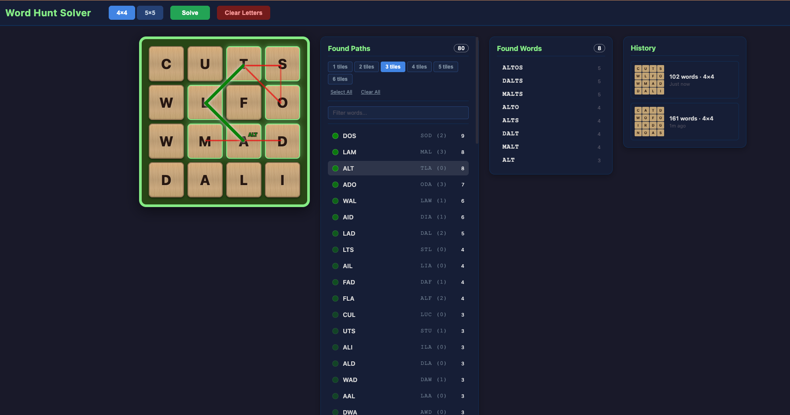

# Word Hunt Solver

## Motivation

GamePigeon's Word Hunt is a competitive word-finding game where two players race to trace words on a shared letter grid. Winning consistently requires more than vocabulary — it requires knowing *where* to look. Certain paths on the board produce far more valid words than others.

This tool analyzes a Word Hunt board and identifies **hot zones** — tile sequences that appear across many valid words. By studying these high-value paths, you can build intuition for where to start swiping and which areas of the board to prioritize during a game.

## What It Does

1. **Board input** — Enter a 4x4 or 5x5 letter grid matching your current Word Hunt game.
2. **Word finding** — A trie-based solver finds all valid English words traceable on the board via adjacent tiles (including diagonals), without reusing any tile within a single word.
3. **Hot zone analysis** — Every sub-path (contiguous segment of a word's path) is extracted and counted. Paths that appear in many different words surface as hot zones, ranked by frequency.
4. **Visualization** — Hot zones are drawn as colored overlays on the board with opacity scaled by frequency. Clicking a hot zone shows which words pass through it, and clicking a word shows its full trace with directional arrows.




## Design

**Backend** — Python with FastAPI. The solver uses a trie built from a dictionary file for prefix-based pruning during DFS traversal. Hot zone computation extracts all sub-paths from every valid word and aggregates them, merging reversed duplicates. The API returns both the word list and hot zone data in a single response.

**Frontend** — Vanilla HTML/CSS/JavaScript with no build step or framework. The board is rendered as a CSS grid, paths are drawn as SVG polylines overlaid on the board, and all state lives in global variables. Scripts are split by concern (board rendering, path drawing, input handling, sounds, etc.) and loaded via individual `<script>` tags.

**Data** — The word dictionary (`data/words.txt`) is the [Collins Scrabble 2019 Dictionary](https://drive.google.com/file/d/1oGDf1wjWp5RF_X9C7HoedhIWMh5uJs8s/view). I found it to be relatively similar to the in-game word dictionary.


## Download

Pre-built apps are available on the [Releases](../../releases) page. Download the file for your operating system:

- **macOS** — `WordHuntSolver-macos.dmg` — Open the `.dmg` and drag the app to your Applications folder.
  > **Note:** macOS may block the app because it is not signed. To open it: try opening the app once (it will be blocked), then go to **System Settings → Privacy & Security**, scroll down, and click **Open Anyway**.
- **Windows** — `WordHuntSolver-windows.exe` — Run the installer and follow the prompts.
- **Linux** — `WordHuntSolver-linux.AppImage` — Make it executable (`chmod +x`) and double-click to run.

No programming tools or setup required.

## How to Run

```bash
# Install dependencies
pip install -r requirements.txt

# Start the server from the backend directory
cd backend
uvicorn app:app --reload

# Open http://localhost:8000 in your browser
```

## Tests

```bash
cd backend
pytest
```

## Next Steps

Gather aggregate statistics on hot zones across many games to identify the most common patterns.
